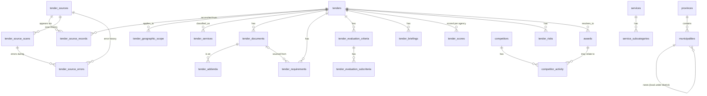
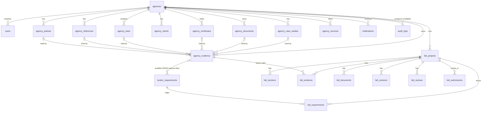

# Database — Tender Intelligence OS

Status: **Phase 2 implemented.** Schema, migrations, RLS, reference seed data, and database-level tests exist and pass against a real Postgres instance (locally in this environment; Supabase-CLI-compatible migration files, unmodified, are what a real Supabase project will run). This document describes the schema as actually built — see `docs/DECISIONS.md` (2026-09-10, "Phase 2 schema deviations") for every point where the implementation adds structure beyond the literal field lists in the Phase 2 instruction, and why.

Not yet built (later phases, explicitly out of scope for Phase 2): scrapers/adapters for any source, AI tender classification, document OCR/extraction, embeddings, the qualification engine, the scoring calculator, proposal/bid generation, red-teaming, compliance gating. Phase 2 established the schema those phases will write into — it does not populate it with anything but reference data.

## 1. Platform and conventions

- PostgreSQL via Supabase, `pgvector` and `pgcrypto` extensions enabled (`database/migrations/20260910200000_extensions.sql`). `pgcrypto`'s `gen_random_uuid()` is the default for every primary key — not `uuid-ossp`.
- Row Level Security is enabled on **every** table, with no exceptions, from the same migration that creates it (`20260910200180_rls_policies.sql` enables it retroactively for tables created earlier in the same migration set, since Phase 2 built the whole schema in one pass — a future new table must enable RLS in the same migration that creates it).
- Every table has `id uuid primary key default gen_random_uuid()` and `created_at timestamptz not null default now()`; every table whose rows are ever updated in place also has `updated_at timestamptz not null default now()`, maintained by the shared `set_updated_at()` trigger function (`20260910200020_helpers.sql`) — never by application code, so it cannot be forgotten on a new table.
- Enumerated states are Postgres `enum` types (full catalogue in §2), not free text — an invalid state is rejected by the database itself.
- Money values are `numeric`, never `float`.
- **Nullable over fabricated.** Nearly every column on `tenders` and its child tables is nullable. A source that doesn't state a closing time leaves `closing_time` null — it is never defaulted, guessed, or backfilled with a plausible-looking value. This is the single most load-bearing convention in the schema (Phase 2 §5: "Do NOT store fabricated values. Nullable values are preferable to invented information.").
- **Evidence-status pairing.** Any column that represents a claim rather than a directly-observed fact (an agency's B-BBEE level, a case study's results, a tender's confidence) is paired with an `evidence_status` enum column (`VERIFIED` / `INFERRED` / `UNVERIFIED` / `UNKNOWN`), defaulting to the least-certain safe value. Application code and UI must read the pairing together — never surface the claim without its status.
- No hard deletes on procurement-relevant history. Most child tables cascade-delete only when their parent tender/agency/bid project is deleted (a genuinely rare, deliberate operation); day-to-day lifecycle changes are new rows or status-column updates, not row removal. `audit_logs` has no delete path for the `authenticated` role at all (§5).

## 2. Enum catalogue

All defined in `database/migrations/20260910200010_enums.sql`; mirrored in `shared/constants/src/provenance.ts` and `shared/constants/src/tenders.ts` so application code and the database can never drift on the set of valid values.

| Enum | Values |
|---|---|
| `evidence_status` | VERIFIED, INFERRED, UNVERIFIED, UNKNOWN |
| `source_type` | OFFICIAL, GOVERNMENT, MUNICIPAL, SOE, AGGREGATOR, MANUAL, OTHER |
| `authority_level` | PRIMARY, SECONDARY, DISCOVERY |
| `source_health` | HEALTHY, WARNING, FAILED, DISABLED |
| `tender_status` | DISCOVERED, VERIFYING, VERIFIED, OPEN, CLOSING_SOON, CLOSED, CANCELLED, AWARDED, WITHDRAWN, UNKNOWN |
| `source_record_status` | ACTIVE, STALE, REMOVED, SUPERSEDED |
| `adapter_state` (Phase 4) | NOT_IMPLEMENTED, CONFIGURED, ACTIVE, PAUSED, FAILED, DISABLED |
| `source_scan_status` (Phase 4) | QUEUED, RUNNING, SUCCESS, PARTIAL, FAILED, CANCELLED |
| `source_error_type` (Phase 4) | NETWORK, TIMEOUT, HTTP, AUTHENTICATION, RATE_LIMIT, PARSING, DOCUMENT, VALIDATION, UNKNOWN |
| `municipality_type` | METRO, DISTRICT, LOCAL |
| `geographic_scope_type` | NATIONAL, PROVINCE, DISTRICT, METRO, LOCAL_MUNICIPALITY, CUSTOM_AREA |
| `document_type` | TOR, RFP, RFQ, BID_DOCUMENT, SBD_FORM, PRICING_SCHEDULE, SPECIFICATION, ANNEXURE, ADDENDUM, BRIEFING_DOCUMENT, DRAWING, OTHER |
| `extraction_status` | PENDING, EXTRACTED, FAILED, NEEDS_REVIEW, NOT_APPLICABLE |
| `requirement_type` | ELIGIBILITY, ADMINISTRATIVE, TECHNICAL, EXPERIENCE, FINANCIAL, TAX, CSD, B_BBEE, COMPANY_REGISTRATION, CERTIFICATION, REFERENCE, BRIEFING, PRICING, SUBMISSION, TEAM, CAPACITY, GEOGRAPHIC, LEGAL, OTHER |
| `qualification_status` | PASS, FAIL, UNKNOWN, REQUIRES_ACTION, NOT_APPLICABLE |
| `severity` | CRITICAL, HIGH, MEDIUM, LOW |
| `scoring_method` | POINTS, PERCENTAGE, PASS_FAIL, RATIO, OTHER |
| `bid_decision` | PRIORITY_BID, BID, REVIEW, CONDITIONAL, NO_BID, UNDECIDED |
| `risk_type` | QUALIFICATION, COMPLIANCE, COMMERCIAL, DELIVERY, CAPACITY, COMPETITION, DEADLINE, CONTRACT, PRICING, DOCUMENTATION, STRATEGIC, OTHER |
| `risk_status` | OPEN, MITIGATED, ACCEPTED, CLOSED |
| `user_role` | ADMIN, BID_MANAGER, RESEARCHER, WRITER, REVIEWER, VIEWER |
| `bid_project_status` | DRAFTING, REVIEW, READY, SUBMITTED, WON, LOST, WITHDRAWN |
| `bid_section_status` | EMPTY, DRAFTED, REVIEWED, APPROVED |
| `bid_review_status` | OPEN, RESOLVED |
| `compliance_state` | READY, BLOCKED |
| `evidence_type` | CASE_STUDY, DOCUMENT, CERTIFICATE, TEAM_MEMBER, CLIENT_REFERENCE, POLICY, OTHER |
| `award_confidence` | VERIFIED, ESTIMATED, INFERRED |
| `competitor_activity_type` | BID_PARTICIPATION, AWARD, WITHDRAWAL, OTHER |
| `notification_event_type` | NEW_RELEVANT_TENDER, CLOSING_SOON, COMPULSORY_BRIEFING, NEW_ADDENDUM, QUALIFICATION_BLOCKER, SCORE_CHANGE, BID_REVIEW, COMPLIANCE_BLOCKER, AWARD_OUTCOME |
| `notification_channel` | IN_APP, EMAIL |
| `actor_type` | USER, SYSTEM, AGENT |

Note: `qualification_status` and `evidence_status` are two distinct vocabularies (see `shared/constants/src/provenance.ts`'s header comment) — do not conflate "does this agency currently satisfy this requirement" with "how confident are we this claim is true."

## 3. Table catalogue

Tables are grouped by the data-category boundary the Phase 2 instruction requires never to blur: **source data** (what a source literally said), **normalised tender data** (the canonical, reconciled record), **analysed intelligence** (scores/risks — derived, agency-relative, always traceable back to a source), **agency data** (an agency's own capability profile), **bid data** (foundational relationships only), **audit data** (append-only history of who/what changed anything).

### 3.1 Source data

| Table | Purpose |
|---|---|
| `tender_sources` | Registry of every known tender-publishing source (eTenders, National Treasury, municipal portals, aggregators, manual entry). `requires_manual_ingestion` (default `true`) is the honesty flag — a source is never implied to be automatically scraped until a real adapter exists. Extended in Phase 4 (`20260911100000_source_registry.sql`, additive columns) with `adapter_key` (the code-level adapter registry key, e.g. `'etenders'` — `null` means honestly NOT CONNECTED, never inferred) and `adapter_state` (`NOT_IMPLEMENTED | CONFIGURED | ACTIVE | PAUSED | FAILED | DISABLED` — independent of `health_status`; a source is only ever `ACTIVE` once a real adapter is registered in code AND an operator has explicitly validated/enabled it, per Phase 5 §21 — see `docs/SCRAPING-ARCHITECTURE.md` §12.10 for why eTenders itself is seeded at `CONFIGURED`, not `ACTIVE`), plus `paused_at`. |
| `tender_source_records` | One row per source's own appearance of a tender, verbatim (`raw_title`, `raw_description`, `raw_closing_date` as the source stated it — not parsed/typed). `tender_id` is nullable until reconciled to a canonical tender; `content_hash`/`document_hash` support later change-detection. This is the audit trail for "what did the source actually say" and for how a merge/dedup decision was made. `unique (source_id, external_id)` is what makes re-ingestion idempotent (Phase 5 §12) — a re-scan of the same source-native record updates this row (`last_seen_at`, `content_hash`, raw fields) rather than inserting a duplicate. |
| `tender_source_scans` | One row per scan/run attempt against a source (Phase 4 §9, written by Phase 5's ingestion pipeline). Lifecycle `QUEUED → RUNNING → SUCCESS/PARTIAL/FAILED/CANCELLED`; records `records_discovered/processed/failed`, `documents_discovered`, `error_count`, `execution_id` (correlates with an external job/run id, e.g. a future BullMQ job — a plain text field, not a foreign key), and `adapter_version`. `on delete cascade` from `tender_sources` — a source's scan history disappears only if the source row itself is deleted. |
| `tender_source_errors` | One row per structured failure encountered during a scan (Phase 4 §10, written by Phase 5's ingestion pipeline) — a single malformed record must never silently vanish (master spec's "never silently discard failed records"). Typed via `source_error_type` (`NETWORK, TIMEOUT, HTTP, AUTHENTICATION, RATE_LIMIT, PARSING, DOCUMENT, VALIDATION, UNKNOWN`) and `severity`; `retryable` records whether Phase 5's retry classification (`apps/api/src/lib/adapters/etenders/retry.ts`) judged this safe to retry. `scan_id` references `tender_source_scans` `on delete set null` — an error is never discarded just because its scan record was later cleaned up. `metadata` is free-form JSONB for non-sensitive diagnostic context only — never a credential, token, or cookie. |

### 3.2 Reference / taxonomy data

| Table | Purpose |
|---|---|
| `provinces`, `municipalities` | South Africa's geographic reference structure. `municipalities.parent_municipality_id` self-references so a local municipality nests under its district; metros and districts have no parent (`municipalities_metro_has_no_parent` / `_district_has_no_parent`). Seeded with all 9 provinces and all 8 metros; district/local structure is seeded for two representative districts only — not claimed to be the complete municipal structure (see `database/seeds/002_municipalities.sql`). |
| `services`, `service_subcategories` | The configurable service taxonomy (21 named services seeded) — never hardcoded into application logic, so an admin can add a service without a code change. |

### 3.3 Normalised tender data

| Table | Purpose |
|---|---|
| `tenders` | The canonical, one-row-per-real-world-tender record. Almost every column is nullable (§1). `province`/`municipality` here are denormalised display-only text, not validated against the geography tables — the authoritative structured relationship is `tender_geographic_scope`. `tenders_number_per_organisation_unique` catches the common duplicate signal (same number, same issuer) without forbidding two different organisations reusing a numbering scheme or a tender with no number at all. |
| `tender_geographic_scope` | Structured, possibly-multi-row geographic applicability (national / one province / one district or metro or local municipality / a custom described area). `tender_geographic_scope_fields_match_type` enforces which columns must be set for each `scope_type`. |
| `tender_services` | Tenders ↔ services taxonomy (many-to-many, `is_primary` + `confidence`). Exists from Phase 2 so "which tenders match our agency's capabilities" is answerable the moment classification data exists (Phase 7+), without a later schema change. |
| `tender_documents` | Every document belonging to a tender (notice, RFP, SBD forms, pricing schedule, addenda, drawings…). `tender_documents_tender_hash_unique` prevents storing the identical file twice against the same tender; a genuine new version needs a different hash. |
| `tender_addenda` | An addendum record. The five `*_changed` booleans (`deadline_changed`, `briefing_changed`, `requirement_changed`, `evaluation_changed`, `pricing_changed`) all default `false` — an addendum is never assumed to change anything until the linked document confirms it (Phase 2 §9). |
| `tender_requirements` | One of the most important tables in the schema — see §3.4. |
| `tender_evaluation_criteria`, `tender_evaluation_subcriteria` | The tender's actual evaluation model, as stated by its documents. `weight` is nullable with no default split — the schema never assumes 80/20 technical/price or any other generic model (Phase 2 §11). |
| `tender_briefings` | Briefing sessions. `mandatory = true` is a potential hard qualification blocker the (future) qualification engine reads alongside `attendance_recorded`. |

### 3.4 `tender_requirements` — evidence-gated qualification

Every requirement is individually traceable to a source document, page, and section. Two independent status columns, deliberately not conflated (see `docs/DECISIONS.md` 2026-09-10, item 4):

- `extraction_status` (`PENDING`/`EXTRACTED`/`FAILED`/`NEEDS_REVIEW`/`NOT_APPLICABLE`) — did the extraction pipeline succeed in reading this requirement out of a document at all.
- `qualification_status` (`PASS`/`FAIL`/`UNKNOWN`/`REQUIRES_ACTION`/`NOT_APPLICABLE`, default `UNKNOWN`) — does *this* agency currently satisfy it.

The database itself — not just application convention — refuses a `PASS` with no linked proof:

```sql
constraint tender_requirements_pass_requires_evidence
  check (qualification_status <> 'PASS' or qualification_evidence_id is not null)
```

`qualification_evidence_id` references `agency_evidence` (§3.5) — the same evidence table every other evidence-citing column in the schema points to.

### 3.5 Analysed intelligence (agency-relative, always derived)

| Table | Purpose |
|---|---|
| `tender_scores` | The result of the deterministic opportunity-scoring calculation, one row per `(tender_id, agency_id, calculated_at)` — never updated in place, so a later recalculation doesn't erase what an earlier decision was actually based on. `agency_id` is a Phase 2 addition (decision log item 1) — a score is inherently agency-relative. Every dimension is CHECK-constrained to its exact allowed range (service_fit 0–20, qualification_likelihood 0–20, relevant_experience 0–15, functionality_potential 0–15, commercial_value 0–10, competition 0–5, time_available 0–5, compliance_risk 0–5, strategic_value 0–5; total 0–100), matching the weighting in `shared/constants/src/scoring.ts` exactly. `tender_scores_mandatory_failure_forces_no_bid` and `tender_scores_mandatory_failure_has_reason` enforce, at the database level, that a mandatory failure always overrides the numeric total to `NO_BID` and always carries its reason — the arithmetic authority is application code (Phase 2 §13: "AI may provide evidence/recommendations but must NOT be the authority for the final arithmetic"), and these constraints are the backstop that makes that non-negotiable even if application code has a bug. |
| `tender_risks` | Risk assessments. `agency_id` is nullable (decision log item 2) — null means a risk inherent to the tender itself (a tight deadline, aggressive pricing terms), a set value means a risk specific to one agency's own situation (capacity, qualification gaps). |
| `awards` | Recorded outcomes. `confidence` (`VERIFIED`/`ESTIMATED`/`INFERRED`, default `INFERRED`) and `source_url` are mandatory-in-spirit — never presented with more certainty than the evidence supports. |
| `competitors`, `competitor_activity` | Competitor participation is recorded only from verifiable award/tender data (`confidence` + `source_url` on every activity row) — nothing here invents a competitor's presence on a tender it wasn't actually observed on. |

### 3.6 Agency data

Every table in this group carries `agency_id` and is fully isolated by RLS (§5).

| Table | Purpose |
|---|---|
| `users` | Mirrors `auth.users` (Supabase Auth owns credentials); holds `role`, `agency_id`, profile fields only. |
| `agencies` | The agency's own profile. Credential-like fields (`b_bbee_level`, `tax_status`) are each paired with an `evidence_status` column (`b_bbee_status`, `tax_status_status` — decision log item 8), defaulting to `UNKNOWN`. |
| `agency_team` | Personnel, with `is_key_personnel` flag. |
| `agency_documents` | Generic agency-owned document store (policies, insurance, registration docs), each with its own `evidence_status`. |
| `agency_certificates` | Certifications with issue/expiry dates — the notification engine (later phase) will read `expiry_date` for expiry alerts. |
| `agency_clients`, `agency_references` | Normalised out of case studies so a reference contact's currency can be tracked independently of the case study text. |
| `agency_policies` | Quality/risk/BEE/environmental policy documents referenced by future proposals. |
| `agency_case_studies` | Rich case-study schema (project, client, budget, deliverables, challenge, solution, results, images, reference contact). `evidence_status` defaults to `UNVERIFIED` — a case study is never presented as verified fact until confirmed. Nothing in the seed data populates this table (§7). |
| `agency_services` | Agency ↔ service-taxonomy many-to-many, keying which of the 21 services (and subcategories) an agency claims to offer. |
| `agency_evidence` | The single, polymorphic evidence table every other table cites when it needs proof of a capability or credential (decision log item 5) — exactly one of `case_study_id`/`document_id`/`certificate_id`/`team_member_id`/`reference_id`/`policy_id` must be set (`agency_evidence_exactly_one_target`). This is what `tender_requirements.qualification_evidence_id` and `bid_evidence.agency_evidence_id` both point to — one evidence concept, cited from two different chains. |

### 3.7 Bid data (relationships only — Phase 2 does not build the workflow)

| Table | Purpose |
|---|---|
| `bid_projects` | One row per agency's bid/no-bid engagement with a tender (`unique(tender_id, agency_id)`). `decision` (`bid_decision` enum) starts `UNDECIDED`. |
| `bid_sections` | The proposal document's sections, keyed by `section_key`. |
| `bid_requirements` | The internal bid matrix: tender requirement → bid section → response/review status. |
| `bid_evidence` | The AGENCY EVIDENCE → GENERATED CLAIM link (Phase 2 §17's evidence chain). `agency_evidence_id` is `not null` — a claim cannot exist with no cited proof. `claim_text` + `verified` fold the "generated claim" concept directly into this table rather than a separate one (decision log item 6). |
| `bid_documents`, `bid_versions`, `bid_reviews`, `bid_submissions` | Supporting documents, full JSON snapshot history, human review comments, and the final submission record, respectively. |

### 3.8 Notifications & audit

| Table | Purpose |
|---|---|
| `notifications` | In-app/email event records (9 event types — new relevant tender, closing soon, compulsory briefing, new addendum, qualification blocker, score change, bid review, compliance blocker, award outcome). |
| `audit_logs` | Append-only. `actor_type` distinguishes `USER`/`SYSTEM`/`AGENT` (`agent_name` required when `actor_type = 'AGENT'`, enforced by `audit_logs_agent_name_required_for_agent`) — every AI-driven change to a procurement-relevant table is auditable the same way a human's is. `agency_id` is nullable (decision log item 3) so system-wide entries and agency-scoped entries share one table. No `UPDATE`/`DELETE` policy exists for the `authenticated` role at all (§5) — only the service role, which bypasses RLS, can write here. |

## 4. Entity relationship diagrams

Split into two diagrams for legibility — the full schema in one diagram is unreadable. Every relationship shown here is a real foreign key in the migrations, not an implied one.

### 4.1 Source → tender → requirements/evaluation/scoring



### 4.2 Agency profile, evidence, and bid relationships



## 5. Row Level Security strategy

RLS is enabled on every table (Phase 2 §25 explicitly forbids disabling it "to simplify development"). Four policy shapes cover the whole schema — see `database/migrations/20260910200180_rls_policies.sql`:

1. **Shared catalogue tables** — `provinces`, `municipalities`, `services`, `service_subcategories`, `tender_sources`, `tenders`, `tender_source_records`, `tender_geographic_scope`, `tender_services`, `tender_documents`, `tender_addenda`, `tender_requirements`, `tender_evaluation_criteria`, `tender_evaluation_subcriteria`, `tender_briefings`, `awards`, `competitors`, `competitor_activity`. `SELECT` only, `using (true)`, for the `authenticated` role — these are public procurement facts, readable regardless of agency. No `INSERT`/`UPDATE`/`DELETE` policy exists for `authenticated`; under Postgres RLS, the absence of a policy for an operation denies it, so writes to these tables can only happen via the privileged service-role client (server-side only — see docs/SECURITY.md §3/§4), never directly from a browser.
2. **Directly agency-owned tables** — `agency_team`, `agency_documents`, `agency_certificates`, `agency_case_studies`, `agency_clients`, `agency_references`, `agency_policies`, `agency_services`, `agency_evidence`, `tender_scores`, `bid_projects`, `notifications`. Full CRUD, all four policies keyed on `agency_id = current_agency_id()` (`current_agency_id()` — `20260910200020_helpers.sql` — resolves the caller's agency from `users` via `auth.uid()`; deliberately `plpgsql`, not `sql`, so it can be created before `users` exists in migration order without a forward-reference error).
3. **Bid sub-tables with no `agency_id` column of their own** — `bid_sections`, `bid_requirements`, `bid_evidence`, `bid_documents`, `bid_versions`, `bid_reviews`, `bid_submissions`. Ownership resolves by an `exists` join up to `bid_projects.agency_id`.
4. **Special cases**, each with bespoke logic: `users` (visible to self or agency colleagues; no write policy — role/agency changes are server-side only), `agencies` (row = the agency itself; select/update scoped to `id = current_agency_id()`), `tender_risks` (nullable `agency_id` — visible when null (general) or matching), `audit_logs` (select-only, `ADMIN` role of the entry's own agency or a null/system-wide entry; no insert/update/delete policy for `authenticated` at all — every audit row is written by the service role, so application code can never forge or omit an entry for its own actions).

The API layer adds a second, independent enforcement point on top of RLS: every read-only repository (`apps/api/src/repositories/*`) resolves a per-request Supabase client scoped to the caller's own verified bearer token (`apps/api/src/lib/supabaseUserClient.ts`), not the privileged service-role client — so even a bug in a repository's own query can never see more than that user's RLS policies allow. The privileged `SUPABASE_SERVICE_ROLE_KEY` client (`apps/api/src/lib/supabaseAdmin.ts`) is reserved for genuinely privileged server-side operations and is never reachable from `apps/web` (enforced structurally by the package `exports` boundary, not just convention — see docs/SECURITY.md §4).

RLS is tested for real against Postgres, not mocked: `database/src/testHelpers.ts`'s `asAuthenticatedUser()` opens a transaction, does `set local role authenticated` plus `select set_config('request.jwt.claim.sub', <uuid>, true)` to make `auth.uid()` resolve as a specific user, runs the test query, and always rolls back — see `database/src/__tests__/schema.test.ts`'s "agency data cannot leak between agencies" suite.

## 6. Local Postgres vs. Supabase (development environment note)

This sandbox cannot run Docker (`/var/run/docker.sock` unreachable) so the Supabase CLI's `supabase start` is unavailable here. A local PostgreSQL 16 instance with `pgvector`/`pgcrypto` was installed directly instead, and a **local-only auth/RLS shim** (`database/scripts/local-only-auth-shim.sql`) creates a minimal `auth` schema (`auth.users`, `auth.uid()`) and the `authenticated`/`service_role` Postgres roles so RLS can be exercised for real. This shim is applied only when `MIGRATE_TARGET=local` (the default) — it is never applied against a real Supabase project (`MIGRATE_TARGET=supabase` skips it, since Supabase already provides `auth.uid()` and these roles natively). All 19 versioned migration files are otherwise ordinary, Supabase-CLI-compatible SQL and need no modification to run against a real Supabase project.

## 7. Seed data

`database/seeds/001_provinces.sql` through `004_tender_sources.sql` seed only reference/taxonomy data that is a documented, verifiable fact regardless of which agency or tender exists: South Africa's 9 provinces, the 8 official metros plus two representative district/local structures, the 21 named services from the Phase 2 instruction, and the known tender source registry (eTenders, National Treasury, CSD, EasyTenders, and known aggregators/municipal/SOE placeholders) — every source row defaults `requires_manual_ingestion = true`. **No tenders, agencies, tender requirements, tender scores, case studies, or any other procurement-relevant or agency-relevant row is ever seeded** — `database/src/__tests__/schema.test.ts`'s first test (`seed data contains no fabricated procurement data`) asserts this by counting those tables at zero straight after a fresh migrate+seed, and fails the suite otherwise.

## 8. Migration strategy

Full detail in `database/README.md`. Summary: one file per logical change under `database/migrations`, named `<UTC timestamp>_<description>.sql` (Supabase CLI's own convention, so these migrations are portable to a real Supabase project unmodified). Forward-only — a mistaken migration is corrected with a new migration, never edited or removed, so procurement/schema history is never silently rewritten. `database/scripts/migrate.mjs` tracks applied migrations in a `schema_migrations` table and applies only what's new. `database/scripts/reset.mjs` (drop+recreate) and `database/scripts/seed.mjs` complete the local dev/test cycle; `database/scripts/run-tests.mjs` orchestrates reset → migrate → seed → `vitest run` so every test run starts from a byte-identical, freshly-migrated, freshly-seeded database.

## 9. Testing

`database/src/__tests__/schema.test.ts` (25 tests, all passing against a live Postgres instance on every full reset) covers, in order: no fabricated seed data; a tender can have multiple sources and a source can have multiple tenders; a tender can have many documents and many requirements (including addenda default-false flags); a tender can have multiple evaluation criteria with a genuinely non-generic weighting (and rejects an over-100 weight); a mandatory qualification failure overrides the opportunity score (and rejects a mandatory failure with no reason, or with a non-`NO_BID` class); duplicate-prevention constraints (source+external-id, tender-number+organisation, same file hash on the same tender) while explicitly allowing the same tender number under a different organisation; a requirement cannot be marked `PASS` without linked agency evidence; and agency data cannot leak between agencies under real RLS (including a rejected cross-agency `INSERT` attempt, and confirming the shared tender catalogue stays visible regardless of agency). See `docs/TESTING.md` for how this fits the project's overall test strategy.

## 10. API read layer (Phase 2's minimal verification layer)

`apps/api/src/repositories/{tenderSources,tenders,services,tenderRequirements,tenderEvaluationCriteria}.ts` are read-only repositories over the shared-catalogue tables, each validating every row against a Zod schema in `@tender-os/schemas` (`shared/schemas/src/tenders.ts`) before it leaves the repository — a malformed row throws rather than silently returning a shape the rest of the app might trust incorrectly. `apps/api/src/routes/catalogue.ts` exposes them as plain `GET` routes behind `requireAuth`, purely to prove the schema and RLS wiring end-to-end from the API; no write routes, matching/scoring, or scraping logic exists at this layer (that is explicitly later-phase work). `GET /api/health` additionally reports real Supabase connectivity, unchanged from Phase 1.

## 11. Known gaps / next phase

- Municipal reference data is seeded for two representative districts only, not the full ~250-municipality structure — the schema already supports the rest; only more seed rows are needed, planned for whenever ingestion needs a specific municipality resolved.
- No source has `requires_manual_ingestion = false` yet — by design; that flips only once a real adapter exists (Phase 4/5+).
- `tender_embeddings` (vector storage for document chunks) was part of the original Phase 0 design sketch but is deliberately not created in Phase 2 — embeddings are explicitly out of scope until the phase that actually generates them, so its column shape (dimension, chunking strategy) isn't guessed at prematurely.
- RBAC at the API layer (role-gated actions beyond what RLS already isolates by agency) is not yet implemented — Phase 1's `requireAuth` establishes identity; role-based authorization is a later-phase addition once there are write actions to gate.

## 12. Phase 6 as-built: document pipeline tables

`database/migrations/20260911120000_document_pipeline.sql` adds
`tender_document_versions` (one row per physical file ever seen for a document
identity, unique on `(document_id, file_hash)` — Phase 6's deduplication/versioning
mechanism), `tender_document_processing` (one row per version: the fine-grained
lifecycle state machine + retry counters, deliberately separate from the existing
`tender_documents.extraction_status`), `tender_document_pages`,
`tender_document_sections`, and `tender_document_chunks` — plus two additive columns
on `tender_documents` (`current_version_id`, `classification`). RLS follows the exact
Phase 2/4 shared-catalogue pattern (§5): `select` for `authenticated`, no
`authenticated` write policy — writes are service-role only, via a new
`DocumentPipelineStore` seam (`apps/api/src/lib/documents/store.ts`) mirroring Phase
5's `IngestionStore` for the same reason (no PostgREST endpoint in this sandbox to
exercise `supabase-js` writes against for a genuine integration test). Full detail,
including the pipeline that populates these tables, in `docs/DOCUMENT-INGESTION.md`.

## 13. Phase 7 as-built: AI classification tables

`database/migrations/20260911140000_ai_classification.sql` adds `tender_ai_runs`
(append-only run history, one row per classification attempt, `status` machine
`QUEUED→RUNNING→COMPLETED|PARTIAL|FAILED|REQUIRES_REVIEW`), `tender_ai_classifications`
(the structured, validated result of one run — `is_current` marks the latest per
`(tender_id, agency_id)`), `tender_ai_deliverables`, `tender_ai_requirements`,
`tender_ai_claims` + `tender_ai_evidence` (the evidence-grounding backbone — every
evidence row FK-references a real `tender_documents`/`tender_document_versions`/
`tender_document_chunks` row, so a claim cannot reference nonexistent or
cross-tender evidence at the database level, not just in application code), and
`tender_ai_conflicts` (a document-vs-database-field disagreement, never
auto-applied). Unlike `tenders` itself (shared catalogue, §5), `tender_ai_runs`/
`tender_ai_classifications` carry a required `agency_id` and are RLS-isolated per
agency — the same shape as `tender_scores` (§8) — since classification relevance is
judged against one agency's configured services. Child tables have no `agency_id` of
their own and are scoped by joining up to their run/classification, the same
convention `bid_sections` etc. use to join up to `bid_projects.agency_id`. A partial
unique index (`tender_ai_runs_one_active_per_tender_agency`) enforces at most one
`QUEUED`/`RUNNING` run per `(tender_id, agency_id)` at the database level — the
idempotency guard is not application-code-only. Full detail in
`docs/AI-DISCOVERY-CLASSIFICATION.md`.

## 16. Phase 8 — Qualification & Compliance Intelligence tables

`database/migrations/20260911160000_qualification.sql` reviewed the existing Phase 2
`tender_requirements`/agency evidence tables first and **extended** them rather than
duplicating: `tender_requirements` gained `category`/`mandatory_status`/`source_truth`
(reusing Phase 7's `ai_truth_state`)/`requirement_status`/`rule_type`/`rule_config`/
versioning columns; `agencies`/`agency_documents`/`agency_certificates`/
`agency_case_studies`/`agency_references` gained the minimum new columns the rule
engine needs (verified numeric turnover lives in a new `agency_financial_records`
table, since `agencies.turnover_band` is a text band). New agency-scoped tables
(same RLS shape as `tender_ai_runs`, §15): `tender_qualification_runs` (append-only,
`is_current` + a partial unique index guarding one active run per tender+agency,
exactly like Phase 7), `tender_qualification_results` (the compliance-check record,
one per evaluated requirement per run) with two evidence child tables
(`tender_qualification_result_tender_evidence`, mirroring `tender_ai_evidence`'s
provenance shape including the still-unpopulated `page_id`; `tender_qualification_result_agency_evidence`,
referencing the already-polymorphic Phase 2 `agency_evidence` table),
`tender_qualification_actions`, and `tender_qualification_reviews` (human review
decisions). `tender_requirement_conflicts` is the one Phase 8 table that is
shared-catalogue (not agency-scoped), since a conflicting requirement value across
documents describes the tender's document set, not any one agency's evidence.
`QualificationInterpretationAgent`'s output reuses `tender_ai_runs`/`tender_ai_claims`/
`tender_ai_evidence` (a new `ai_claim_type` value, `QUALIFICATION_INTERPRETATION`) plus
one small new table, `tender_qualification_ai_interpretations`, for its extra
structured fields — not a parallel AI schema. Full detail in
`docs/QUALIFICATION-ENGINE.md`.

## 17. Phase 9 — Requirement & Evaluation Extraction tables

`database/migrations/20260911180000_requirement_evaluation_extraction.sql` extended the existing Phase 2
`tender_requirements`/`tender_evaluation_criteria` tables rather than duplicating them: `requirement_type`
gained the full Phase 9 taxonomy (`QUALIFICATION`/`FUNCTIONALITY`/`COMMERCIAL`/`PRICE`/`PREFERENCE`/
`LOCAL_CONTENT`/`CONTRACTUAL`/`INFORMATIONAL`), `qualification_requirement_status` gained `CONFLICT`,
`tender_requirements` gained `parent_requirement_id` (self-referencing, for hierarchy), `disqualification_risk`,
and `ai_claim_id`; `tender_evaluation_criteria` gained `parent_criterion_id`, `criterion_type`
(new `evaluation_criterion_type` enum), `maximum_points`/`scoring_bands`/`gate`/`threshold_type`/
`formula_text`/`formula_type`/`formula_variables`/`local_content_min_percent`/`presentation_*` columns, plus
the same `source_truth`/`status`/versioning/`ai_run_id`/`ai_claim_id` columns Phase 8 added to
`tender_requirements`. New tender-scoped, shared-catalogue tables (readable by any authenticated user,
writable only by the service role — since a requirement/criterion is a property of the tender's document
set, not any one agency's relationship to it): `tender_requirement_evidence`, `tender_requirement_reviews`,
`tender_evaluation_criterion_evidence`, `tender_evaluation_gates` (+ `tender_evaluation_gate_evidence`),
`tender_evaluation_conflicts`, and `tender_evaluation_criteria_reviews` (a `CHECK` constraint requires
exactly one of `criterion_id`/`gate_id` to be set). `tender_requirement_conflicts` (Phase 8) is reused
unchanged for requirement-level conflicts. Because extraction is tender-scoped rather than agency-scoped,
`tender_ai_runs.agency_id` was relaxed to nullable, with a new `tender_ai_runs_select_shared`/
`tender_ai_claims_select_shared`/`tender_ai_evidence_select_shared` RLS policy set (`agency_id is null`)
and a dedicated partial unique index, `tender_ai_runs_one_active_per_tender_no_agency`, enforcing at most
one `QUEUED`/`RUNNING` no-agency run per tender — the existing per-`(tender_id, agency_id)` index from
Phase 7 is untouched and still governs agency-scoped runs. `tender_ai_runs` also gained
`evidence_coverage`/`conflict_count`/`unknown_count`/`requires_review_count` quality-gate columns, and
`ai_claim_type` gained `REQUIREMENT_EXTRACTION`/`EVALUATION_CRITERION_EXTRACTION`/
`EVALUATION_GATE_EXTRACTION`. Full detail in `docs/REQUIREMENT-EVALUATION-EXTRACTION.md`.

## 18. Phase 10 — Opportunity Scoring Engine tables

`database/migrations/20260911220000_opportunity_scoring.sql`. `agencies` gained `min_project_value`,
`target_sectors`, `preferred_org_types`, `strategic_capabilities`, `strategic_profile_status` (Commercial/
Strategic Fit inputs — all nullable/empty-default, never fabricated). New `agency_geographic_scope`
mirrors the existing `tender_geographic_scope` shape exactly (same `geographic_scope_type` enum, same
province/municipality FK-lite pattern — the Phase 7/8 textual-geography limitation is carried forward
unchanged, not fixed here). New `tender_evaluation_criterion_agency_evidence` is the ONLY mechanism the
scoring engine may use to say a Phase 9 evaluation criterion is evidence-backed — an explicit,
human/reviewer-asserted link (`criterion_id`, `agency_id`, `evidence_type` discriminator, `evidence_id`),
never auto-populated by any semantic/text matching. New versioned scoring configuration:
`scoring_configurations` (named policies, e.g. `'default'`) → `scoring_configuration_versions` (one
`is_current` row per configuration; `dimension_weights`/`qualification_status_score_map`/
`requirement_coverage_value_map`/`evaluation_fit_value_map`/`evidence_state_value_map`/`decision_bands`/
`data_completeness_insufficient_threshold`/`critical_dimensions` as JSONB — the single config source the
engine reads rather than scattering these values through TypeScript). New append-only
`tender_scoring_runs` (agency-scoped exactly like `tender_qualification_runs`: one `is_current` row per
`(tender_id, agency_id)`, one active `QUEUED`/`RUNNING` row per `(tender_id, agency_id)`, an
`input_snapshot` JSONB for staleness/audit) with four per-run child tables —
`tender_score_components` (always exactly the six dimensions, a `CHECK` constraint enforces `score IS
NOT NULL ⟺ status = 'KNOWN'`), `tender_score_drivers`, `tender_score_risks`, `tender_score_gates`
(always exactly the five hard gate types). RLS on every new table follows the Phase 8 agency-scoped
pattern exactly (`scoring_configurations`/`scoring_configuration_versions` are the one exception — shared
catalogue, `select true for authenticated`, same as `tender_requirements` itself). Full detail in
`docs/SCORING-ENGINE.md`.

## 19. Phase 11 — Bid/No-Bid Intelligence Engine tables

`database/migrations/20260911240000_bid_decision_engine.sql`. New enums: `bid_recommendation`
(`BID`/`NO_BID`/`REVIEW` — deliberately distinct from the pre-existing `bid_decision` enum backing
`bid_projects.decision`), `bid_rule_status`, `bid_rule_severity`, `bid_effort_level`,
`bid_decision_run_status`, `bid_decision_outcome` (future outcome-learning seam, unpopulated). New
agency-owned, versioned bid policy: `bid_policies` (one row per `(agency_id, name)`, e.g. `'default'`) →
`bid_policy_versions` (one `is_current` row per policy; every threshold — `minimum_opportunity_score`,
`minimum_data_completeness`, `minimum_requirement_coverage`, `minimum_evidence_strength`,
`minimum_evaluation_fit`, `minimum_strategic_fit`, `minimum_contract_value`, `minimum_preparation_days`,
`maximum_preparation_days`, `minimum_expected_margin`, `maximum_bid_effort`,
`excluded_organisation_types`, `excluded_sectors`, `unresolved_evaluation_conflict` — stored as a
`{active, severity, value}` JSONB object or `null`; `precedence`, `hard_gate_overrides`,
`unknown_severity`, `score_bands`, `preferred_services`/`preferred_sectors`/
`preferred_organisation_types`/`preferred_provinces` complete the configuration). New append-only
`bid_decision_runs` (agency-scoped exactly like `tender_scoring_runs`: one `is_current` row per
`(tender_id, agency_id)`, one active `QUEUED`/`RUNNING` row per `(tender_id, agency_id)`, an
`input_snapshot` JSONB referencing the Phase 10 `scoring_run_id` it was computed from) storing
`system_decision`/`human_decision`/`final_decision`/`override_reason`/`overridden_by`/`overridden_at`
side by side, plus `bid_effort`/`bid_effort_explanation`/`decision_explanation` and a nullable `outcome`
(future seam). Two `CHECK` constraints enforce the two most safety-critical properties at the database
level, not only in application code: `bid_decision_runs_override_requires_reason` (a human override
requires a non-null, non-empty-after-trim reason plus `overridden_by`/`overridden_at`) and
`bid_decision_runs_final_decision_consistent` (`final_decision` always equals `human_decision` when
present, otherwise `system_decision`). One child table, `bid_decision_rule_results` (one row per rule per
run — `rule_id`, `precedence_step`, `status`, `severity`, `actual_value`/`expected_value` JSONB,
`explanation` — unique per `(run_id, rule_id)`). RLS on every new table follows the Phase 8/10
agency-scoped pattern exactly; unlike Phase 10's shared-catalogue `scoring_configurations`, `bid_policies`/
`bid_policy_versions` ARE agency-scoped (bid policy is this agency's own business rules, not a shared
tender-scoring default). Audit events (`BID_DECISION_CREATED`, `BID_DECISION_OVERRIDDEN`) are written into
the existing generic `audit_logs` table (Phase 2 §22), not a new audit table. Full detail in
`docs/BID-NO-BID-ENGINE.md`.

## 20. Phase 12 — Bid Strategy & Bid Project Intelligence tables

Migration: `database/migrations/20260911260000_bid_strategy_engine.sql`. See that file's header for the full collision analysis against the pre-existing (unused) Phase 2 `bid_projects`/`bid_sections`/`bid_requirements`/`bid_evidence`/`bid_documents`/`bid_versions`/`bid_reviews`/`bid_submissions` tables, none of which this phase touches.

**Enums:** `bid_strategy_project_status` (DRAFT/STRATEGY/IN_PROGRESS/INTERNAL_REVIEW/READY_FOR_SUBMISSION/SUBMITTED/CLOSED/CANCELLED), `bid_strategy_priority` (LOW/MEDIUM/HIGH/CRITICAL), `bid_strategy_status` (DRAFT/IN_REVIEW/APPROVED/SUPERSEDED), `bid_win_theme_source_type`, `bid_evidence_support_status` (UNKNOWN/EVIDENCE_REQUIRED/SUPPORTED/PARTIALLY_SUPPORTED/UNVERIFIED), `bid_priority_class` (CLIENT/TENDER), `bid_requirement_response_type`, `bid_requirement_response_status`, `bid_evidence_need_status`, `bid_workstream_category`, `bid_task_type`, `bid_task_status`, `bid_milestone_status`, `bid_question_status`, `bid_risk_status`, `bid_assumption_status`, `bid_gap_severity` (CRITICAL/HIGH/MEDIUM/LOW, reused everywhere a deterministic severity is needed), `bid_source_type`.

**Tables** (all `id uuid primary key default gen_random_uuid()`, all with `created_at`/`updated_at` triggers where mutable):
- `bid_strategy_projects` — the Phase 12 "Bid Project". FKs: `tender_id → tenders`, `agency_id → agencies`, `bid_decision_run_id → bid_decision_runs` (not null — a Bid Project cannot exist without a traceable Phase 11 decision). Unique partial index: one active (non-CANCELLED/CLOSED) project per (tender_id, agency_id).
- `bid_strategy_project_status_history` — append-only transition audit (from_status/to_status/changed_by/changed_at), FK to `bid_strategy_projects`.
- `bid_strategies` — versioned strategy (narrative fields only: objective, strategy_summary, and per-area summaries). Unique (bid_project_id, version); unique partial index on `is_current`; `supersedes_strategy_id` self-FK; `input_snapshot jsonb` for staleness. A `prevent_approved_bid_strategy_mutation` trigger makes an APPROVED row immutable except the one permitted SUPERSEDED/is_current=false transition.
- `bid_strategy_priorities` — client/tender priorities, `priority_class` CLIENT|TENDER, `source_type`/`source_id`/`weight`/`rank`.
- `bid_win_themes` — CHECK: non-HUMAN_DEFINED source must carry a `source_id` (traceability).
- `bid_differentiators` — CHECK: SUPPORTED/PARTIALLY_SUPPORTED requires `supporting_evidence_count > 0`.
- `bid_evaluation_strategies` — one row per (strategy_id, evaluation_criterion_id), FK to `tender_evaluation_criteria`.
- `bid_requirement_plans` — one row per (strategy_id, tender_requirement_id), FK to `tender_requirements`.
- `bid_evidence_needs` — evidence REQUESTS only (never auto-selected evidence); `minimum_count`/`current_count`, `severity`, `status`.
- `bid_workstreams` — unique (bid_project_id, category); only categories the tender's actual data supports are ever inserted (application discipline in `buildBidStrategy`, not a DB constraint).
- `bid_tasks` — `workstream_id` FK, self-FK `dependency_task_id`, `source_type`/`source_id` traceability.
- `bid_milestones` — `status` plus a live-computed `computed_status` (AT_RISK/MISSED) at read time (`lib/bidStrategy/milestones.ts`), never silently mutated on read.
- `bid_questions` — CHECK: `answer` requires `answer_source` (never an invented answer).
- `bid_risks`, `bid_assumptions` — deterministic source_type/source_id traceability.
- `bid_readiness_snapshots` — schema exists for future audit-trail history; not yet written by the live `GET /readiness` route in this phase (documented limitation).

**RLS:** every table above has `alter table ... enable row level security` plus one `for select to authenticated` policy scoped to `agency_id = current_agency_id()` (directly, or via an `exists (select 1 from bid_strategy_projects ...)` join for child tables) — no authenticated INSERT/UPDATE/DELETE policy anywhere; every mutation goes through `lib/bidStrategy/supabaseBidStrategyStore.ts` with the service-role client, only after `routes/bidStrategy.ts` has checked role + business rules. Verified in `database/src/__tests__/bidStrategy.test.ts` (13 tests: agency isolation, service-role-only writes, CHECK constraints, immutability, one-active-project-per-tender+agency, malformed-UUID rejection).

## Phase 13 — Evidence Matching & Portfolio Intelligence

Full detail in `docs/EVIDENCE-MATCHING.md`. Migration: `20260911280000_evidence_matching.sql`.

**Enums:** `evidence_embedding_status` (NOT_EMBEDDED/QUEUED/PROCESSING/READY/STALE/FAILED),
`evidence_embedding_entity_type` (AGENCY_DOCUMENT/AGENCY_CERTIFICATE/AGENCY_CASE_STUDY/AGENCY_REFERENCE/
AGENCY_FINANCIAL_RECORD), `evidence_match_status` (CANDIDATE/REQUIRES_VERIFICATION/VERIFIED/APPROVED/
REJECTED/SUPERSEDED — AI/semantic scoring can only ever write up to VERIFIED).

**pgvector** (already enabled since `20260910200000_extensions.sql`; this is the first phase to actually
write to a vector column): `agency_evidence_embeddings.embedding vector(1536)`,
`tender_evidence_chunk_embeddings.embedding vector(1536)`, both with an `ivfflat`/`vector_cosine_ops`
index. `match_agency_evidence_embeddings(p_agency_id, p_query_embedding, p_top_k)` is the **only** place a
vector similarity query happens — always `WHERE agency_id = p_agency_id ORDER BY embedding <=> ... LIMIT
p_top_k`, never a cross-tenant scan (proven directly in `database/src/__tests__/evidenceMatching.test.ts`).

**Tables:**
- `agency_evidence_embeddings` — agency-scoped, polymorphic (exactly-one-target `CHECK`, mirroring the
  Phase 2 `agency_evidence` pattern) across the five agency evidence tables. `content_hash` compared on
  every re-embed to detect drift → STALE. A `CHECK` (`..._vector_matches_status`) makes a READY/STALE row
  without a vector, or any other status with one, structurally impossible.
- `tender_evidence_chunk_embeddings` — tender-scoped (not agency-scoped — see `docs/DECISIONS.md`),
  one row per `tender_document_chunks` row, same lifecycle/CHECK shape as above. Shared-catalogue RLS
  (`select` for any `authenticated` user), matching `tender_document_chunks` itself. Schema-only in this
  phase (documented limitation — nothing populates or queries it yet).
- `bid_evidence_matches` — one row per (evidence need × candidate), append-only on status change.
  Exactly-one-target `CHECK` across the five candidate FK columns; `bid_evidence_matches_rejection_requires_reason`
  CHECK (mirrors Phase 12's `bid_questions` answer/answer_source pattern);
  `bid_evidence_matches_decided_requires_actor` CHECK. `prevent_decided_evidence_match_mutation` trigger
  makes an APPROVED/REJECTED row's every scored/verification/decision field immutable except the exact
  superseding-on-re-evaluation transition. Unique partial index: one CURRENT row per (evidence_need_id,
  candidate entity) pairing.
- `bid_evidence_claims` — the authoritative approved linkage, written only by `approveMatch`. Unique
  partial index: one *active* (non-revoked) claim per evidence need at a time.
  `bid_evidence_claims_revoked_requires_reason` CHECK.

**RLS:** `agency_evidence_embeddings`/`bid_evidence_matches`/`bid_evidence_claims` — `select` for
`authenticated` scoped to `agency_id = current_agency_id()`. `tender_evidence_chunk_embeddings` — shared-
catalogue `select` for any `authenticated` user. No authenticated INSERT/UPDATE/DELETE policy anywhere —
service-role only, via `lib/evidenceMatching/supabaseEvidenceMatchingStore.ts`. Verified in
`database/src/__tests__/evidenceMatching.test.ts` (13 tests: agency isolation for embeddings and matches,
service-role-only writes, the agency-scoped vector function, every CHECK constraint, decided-row
immutability and its one permitted supersession transition, active-claim-per-need uniqueness and its
revoke-then-reapprove flow, malformed-UUID rejection).

## Phase 14 — Proposal generation tables

Full detail in `docs/PROPOSAL-GENERATION.md`. New tables (all `bid_proposal_*`, none collide with the
pre-existing Phase 2 `bid_sections`/`bid_documents`/`bid_versions`/`bid_evidence`/`bid_reviews`, which are
left completely untouched): `bid_proposals` (1:1 per `bid_strategy_projects` row), `bid_proposal_versions`
(append-only, `is_current` unique-per-proposal), `bid_proposal_sections`, `bid_proposal_blocks`,
`bid_proposal_claims`, `bid_proposal_requirement_links`, `bid_proposal_evaluation_links`,
`bid_proposal_evidence_links`, `bid_proposal_generations`, `bid_proposal_reviews`,
`bid_proposal_compliance_results`/`_issues`, `bid_proposal_missing_information`,
`bid_proposal_section_edit_history`, `bid_proposal_documents`.

Key constraints: `bid_proposal_claims_supported_requires_evidence` CHECK (SUPPORTED/PARTIALLY_SUPPORTED
require a real `evidence_claim_id`); `bid_proposal_reviews_reject_requires_reason` CHECK;
`prevent_historical_proposal_version_mutation` (a non-current version's `input_snapshot`/`notes` are
frozen); `prevent_approved_section_identity_mutation` (an `APPROVED_INTERNAL` section's
title/objective/section_type are frozen); `prevent_approved_section_block_mutation` (blocks under an
`APPROVED_INTERNAL` section cannot be updated or deleted at all). Cross-agency/cross-tender integrity is
enforced by triggers, not just FKs: `check_proposal_section_agency_matches`,
`check_proposal_evidence_link_agency_matches`, `check_proposal_claim_evidence_agency_matches`,
`check_proposal_requirement_link_tender_matches`, `check_proposal_evaluation_link_tender_matches`.

**RLS:** every table — `select` for `authenticated` scoped to `agency_id = current_agency_id()` (directly
or via a join to `bid_proposal_sections`/`bid_proposal_versions`). No authenticated INSERT/UPDATE/DELETE
policy anywhere — service-role only, via `lib/proposals/supabaseProposalStore.ts`. Verified in
`database/src/__tests__/proposalGeneration.test.ts` (19 tests: agency isolation, service-role-only writes,
one-proposal-per-project uniqueness, every CHECK/trigger above including the cross-agency evidence-claim
citation rejection, and malformed-UUID rejection).

## Phase 15 — Submission readiness, pricing, submission pack tables

Full detail in `docs/SUBMISSION-READINESS.md`. New tables, none colliding with the pre-existing Phase 2
`bid_documents`/`bid_versions`/`bid_reviews`/`bid_submissions` (re-verified unreferenced and left untouched)
or the pre-existing `tender_addenda` (Phase 2 §9, reused as-is, not re-implemented):

- `bid_pricing` (one row per version, `is_current` unique per bid project) / `bid_pricing_items` (line
  number/description/quantity/unit/unit price/line total/mandatory-schedule flag; CHECKs enforce
  non-negative quantity and unit price).
- `bid_submission_readiness` (one immutable snapshot per compliance run, `is_current` unique per bid
  project; FKs to an exact `bid_proposal_versions` row and an exact `bid_pricing` row, never "the latest")
  / `bid_submission_readiness_items` (one row per BLOCKER/WARNING/INFO, with category/severity/code/
  message/source).
- `bid_submission_packs` (versioned, unique `(bid_project_id, version)`, `status = 'CURRENT'` unique per
  project) / `bid_submission_pack_files` (sha256/mime/size/source table+id per packaged file) /
  `bid_submission_manifests` (one manifest JSON row per pack).
- `bid_submission_approvals` (references an exact `readiness_id` + `pack_id`; `status = 'APPROVED'` unique
  per project; CHECK requires a non-empty `approval_reason` and requires `revoked_by`/`revoked_at` whenever
  `status = 'REVOKED'`).

Key constraints/triggers: `prevent_historical_readiness_mutation` (a non-current readiness snapshot's
status/snapshot/category-summary/version-references are frozen, mirroring Phase 14's
`prevent_historical_proposal_version_mutation`); `prevent_submission_pack_mutation` (a pack's manifest/
version references are frozen once created — a change always creates a new, higher-versioned pack, never
an overwrite). No new cross-agency-guard triggers were needed beyond the existing FK/agency_id-column
pattern, since every Phase 15 table hangs directly off `bid_strategy_projects`/`bid_pricing`/
`bid_submission_readiness`/`bid_submission_packs` (verified by dedicated cross-agency DB tests below rather
than assumed).

**RLS:** every table — `select` for `authenticated` scoped to `agency_id = current_agency_id()` (directly,
or via a join to `bid_submission_readiness` for its items). No authenticated INSERT/UPDATE/DELETE policy
anywhere — service-role only, via `lib/submissionReadiness/supabaseSubmissionReadinessStore.ts`. Verified in
`database/src/__tests__/submissionReadiness.test.ts` (14 tests: agency isolation, service-role-only writes,
one-CURRENT-readiness/one-CURRENT-pack/one-ACTIVE-approval uniqueness, historical-snapshot and pack
immutability, pricing-item quantity/unit-price CHECKs, approval reason-required and revoke-requires-actor
CHECKs, and malformed-UUID rejection).

### Phase 16 tables — Submission Execution, Submission Tracking & Receipt Intelligence

Migration `20260912000000_submission_execution.sql`, hanging directly off Phase 15's
`bid_submission_readiness`/`bid_submission_packs`/`bid_submission_approvals` and Phase 12's
`bid_strategy_projects` — no collision with the legacy, unused `bid_submissions`/`bid_projects` (Phase 2),
which remain completely untouched.

- `bid_submission_executions` — one live aggregate row per bid project (`unique(bid_project_id)`),
  carrying the exact `approved_readiness_id`/`submission_pack_id`/`submission_pack_version`/
  `submission_pack_hash`/`manifest_hash` this execution is authorised against, plus a `version` integer
  used as an optimistic-concurrency guard on every write.
- `bid_submission_confirmations` — durable, server-recorded human confirmation; immutable once created
  (`prevent_submission_confirmation_mutation` trigger — only `invalidated`/`invalidated_reason`/
  `invalidated_at` may ever change).
- `bid_submission_attempts` — append-only; `bid_submission_attempts_one_active_idx` (partial unique on
  `status = 'STARTED'`) permits at most one in-flight attempt per execution; `idempotency_key` is globally
  unique; `prevent_submission_attempt_mutation` freezes a terminal (non-`STARTED`) attempt's every field —
  a new fact requires a new attempt row, never a rewrite.
- `bid_submission_receipts` — append-only evidence; `prevent_submission_receipt_mutation` freezes every
  evidentiary field once created, leaving only `verification_status`/`notes` mutable (e.g. a later
  independent corroboration upgrading `UNVERIFIED` → `VERIFIED`, or a conflict downgrading to
  `CONFLICTING`).

**RLS:** identical convention — agency-scoped `select` for `authenticated` on all four tables, no
authenticated write policy anywhere, service-role only via
`lib/submissions/supabaseSubmissionExecutionStore.ts`. Verified in
`database/src/__tests__/submissionExecution.test.ts` (14 tests: agency isolation, service-role-only writes,
one-execution-per-project uniqueness, confirmation immutability, attempt FK enforcement, one-active-attempt
concurrency guard, idempotency-key uniqueness, terminal-attempt immutability, receipt evidence-field
immutability, and malformed-UUID rejection).

## Phase 17 addendum — Awards, Outcomes & Learning tables

`database/migrations/20260912200000_awards_outcomes_intelligence.sql` adds
`tender_outcomes` (append-only/versioned FACT layer, extends `awards`),
`outcome_conflicts`, `bid_outcomes` (agency-scoped, reconciled from Phase 16
submission state), `loss_reasons`, and the two learning-feature tables
`outcome_decision_time_features` (immutable once captured) and
`outcome_result_features` (the only table permitted to carry post-outcome
facts for learning). `competitors`/`competitor_activity` are extended with new
columns, not replaced. Full column list, indexes, RLS and constraints in the
migration file itself and `docs/OUTCOME-INTELLIGENCE.md` §2.

## Phase 18 addendum — Predictive Intelligence tables

`database/migrations/20260912220000_predictive_intelligence.sql` adds 12
agency-scoped tables per `docs/PREDICTIVE-INTELLIGENCE.md` §27 naming:
`model_datasets`, `model_registry`, `model_versions`, `model_training_runs`,
`model_evaluations`, `model_calibrations`, `model_predictions`,
`prediction_abstentions`, `model_card_documents`, `score_calibration_reports`,
`retrospective_segments`, `model_audit_events`. **RLS:** the same convention
as every agency-owned table since Phase 2 — agency-scoped `select` for
`authenticated`, no authenticated write policy anywhere, service-role only
via `lib/intelligence/supabaseIntelligenceStore.ts`. Three immutability
triggers freeze `model_versions` once its fitted parameters are captured,
freeze `model_evaluations`/`model_calibrations` once computed (a re-run
creates a new row, never a rewrite), and freeze `model_predictions` (a
prediction is a permanent historical fact, never edited after the model that
produced it is later retired or superseded). A partial unique index enforces
at most one `model_registry` row `status = 'PRODUCTION'` per model at a
time. Verified in `database/src/__tests__/intelligence.test.ts` (17 tests:
agency isolation, service-role-only writes, immutability triggers,
one-production-version uniqueness, FK integrity, check constraints,
malformed-UUID rejection).

## Phase 19 — Production Operations tables

`database/migrations/20260913090000_phase19_production_operations.sql`
adds two tables:

- `bid_addendum_acknowledgements` (agency-scoped) — one row per
  (bid project, addendum) human acknowledgement. Fully immutable after
  insert (a Postgres trigger rejects any `UPDATE` outright — an
  acknowledgement is a point-in-time attestation, never edited).
  `bid_addendum_acknowledgements_unique` (`bid_project_id, addendum_id`)
  makes a repeat acknowledge call idempotent at the application layer
  (`repositories/tenderAddenda.ts::acknowledgeAddendum` reads the
  existing row back rather than erroring, including on a unique-
  violation race).
- `data_quality_violations` — `agency_id` nullable (null = shared/
  catalogue-scoped, e.g. a tender-level gap; set = agency-scoped, e.g.
  a submission-evidence gap). A partial unique index
  (`rule, entity_type, entity_id) where status = 'OPEN'`) allows only
  one OPEN violation per real problem. A trigger freezes the detected
  facts (`rule`/`entity_type`/`entity_id`/`detected_at`/`agency_id`)
  once written — only `status`/`resolution`/`resolved_by`/`resolved_at`
  may change. A CHECK constraint requires `resolution`/`resolved_by`/
  `resolved_at` whenever `status` moves to `RESOLVED`/`DISMISSED`.

**RLS:** `bid_addendum_acknowledgements` follows the standard
agency-owned convention (`agency_id = current_agency_id()` select-only
for `authenticated`); `data_quality_violations` uses
`agency_id is null or agency_id = current_agency_id()` so shared rows
are visible to every authenticated user like the tenders they describe.
Both are service-role-write-only. Verified by 11 new tests in
`database/src/__tests__/productionOps.test.ts` (RLS isolation for both
tables, service-role-only writes, uniqueness, full immutability,
required-reason CHECK, detected-fact immutability even for
service-role updates).

## Phase 20 addendum — surveillance/benchmarks/audit schema

`20260914100000_phase20_surveillance_benchmarks_audit.sql` (additive only):

- **`tender_addenda` extended**: `content_hash`, `impact_assessment` (jsonb), `detected_via`
  ('DOCUMENT' | 'DIFF_ENGINE'); `document_id` relaxed to nullable, with a CHECK constraint still requiring
  it whenever `detected_via = 'DOCUMENT'` (the original Phase 2 §9 path is unweakened).
- **`audit_trail_events`** (new): append-only, immutable (update AND delete both rejected by trigger),
  correlated by `correlation_id`, restricted to ADMIN visibility (own agency plus agency-null/system-wide
  rows), service-role-write-only.
- **`industry_benchmarks_daily`** (new): fully anonymized, no agency scoping at all — any authenticated
  user may read it. A CHECK constraint (`industry_benchmarks_daily_k_anonymity`) rejects any row asserting
  real statistics (non-null p25/p50/p75/mean/stddev) with `sample_size < 5`; a below-floor row may still
  exist with every statistic null (the honest "insufficient data" marker). Unique on
  `(metric_date, category, region, metric_type)`.

`bid_addendum_acknowledgements` (Phase 19, singular "addendum") is unchanged and NOT duplicated under the
spec's literal plural name — see `docs/DECISIONS.md` Phase 20 §3.

All 37 migrations apply cleanly in order against a fresh Postgres 16 instance; 225/225 database tests pass
(17 new in `database/src/__tests__/phase20.test.ts`).
