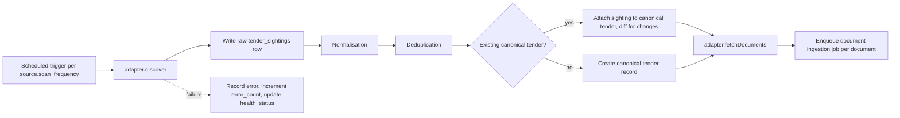

# Scraping Architecture — Tender Intelligence OS

Status: Phase 5 as-built. Phase 4 built the Source Registry (adapter contract, adapter registry, health model, scan/error history, RBAC) with no scraper behind it. Phase 5 adds the first real adapter — eTenders — end to end: discovery, normalisation, deduplication, canonical tender creation, source records, document discovery, scan/error lifecycle, rate limiting/retries, and a domain allow-list. §11 records Phase 4's as-built; §12 records Phase 5's, including this build environment's live-network limitation, stated honestly.

## 1. Principle

Aggregators are discovery sources; the original tender document and its issuing portal remain authoritative (spec §4). The system must never claim to have scanned "every tender on the internet" — only "all opportunities discovered across the configured tender-source network" (spec §5), and it must make its own coverage visible (source count, health, last scan) rather than implying completeness.

## 2. Source Adapter contract

Every source — eTenders, National Treasury, a municipality, an aggregator — implements the same interface (spec §15). No source gets a bespoke, unrelated implementation:

```typescript
interface TenderSourceAdapter {
  discover(): Promise<TenderDiscovery[]>
  fetchDetails(id: string): Promise<TenderDetails>
  fetchDocuments(id: string): Promise<DocumentReference[]>
  healthCheck(): Promise<SourceHealth>
}
```

`TenderDiscovery` is a minimal shape (source-native id, title, organisation, closing date if visible, URL) returned cheaply from a listing page; `fetchDetails` does the more expensive per-tender fetch; `fetchDocuments` returns downloadable references without downloading them (the document pipeline owns downloading). `healthCheck` returns the same `HEALTHY|WARNING|FAILED|DISABLED` vocabulary stored on `tender_sources.health_status` (DATABASE.md §3.2), so a source's own adapter is the one thing responsible for reporting its own health honestly.

As actually implemented in Phase 4 (`apps/api/src/lib/adapters/types.ts`), the interface adds two identity fields every concrete adapter must declare (`key`, matching `tender_sources.adapter_key` exactly — this is the join between a database row and a code module; `version`, recorded on every scan row as `adapter_version`) and `healthCheck()` returns a richer `{ status: 'HEALTHY'|'WARNING'|'FAILED', message, checkedAt }` rather than the bare enum, since the Source Registry needs a human-readable reason, not just a status code. This is additive to the contract above, not a deviation from it.

Each concrete adapter lives in its own package (`scrapers/etenders`, `scrapers/treasury`, `scrapers/municipalities`, `scrapers/soe`, `scrapers/easytenders`, `scrapers/generic`) and depends only on the shared adapter contract and shared utilities — never on another adapter, and never on the API layer directly (adapters are invoked by workers, which then hand results to the API/services layer for persistence, keeping the "only repositories write to the database" rule from ARCHITECTURE.md §6 intact for scraped data too).

`scrapers/generic` provides a base class for simple HTML-listing sources (most municipal sites) so that a new secondary source is a small configuration (selectors + pagination pattern) rather than a full bespoke adapter — but it still implements the same interface, and its output goes through identical normalisation and dedup.

## 3. Legality and access boundaries (non-negotiable)

Per spec §16, every adapter must:

- Respect `robots.txt` and each site's terms of service.
- Respect rate limits — a per-source configurable delay/concurrency cap, not a shared global crawl rate, since sources differ in tolerance.
- Respect authentication boundaries — an adapter never attempts to authenticate as anyone other than a legitimately provisioned account the agency has rights to use.
- Never attempt to bypass CAPTCHA, defeat anti-bot protection, or scrape content behind access controls it isn't authorized to cross.

If a source cannot be accessed automatically (blocked, requires manual login with no API, protected by anti-bot measures that would require bypassing), the correct behavior is: record the source in `tender_sources` with `health_status = DISABLED` (or `FAILED` if it was previously working and stopped), flag it as `requires_manual_ingestion = true` (an additional boolean beyond the spec §14 minimum field set, needed to make this state visible in the Source Registry UI — see Phase 4), and surface it plainly rather than silently dropping it from coverage reporting. A disabled source still counts in "number of sources" and "failed sources" displays (spec §5) — hiding it would misrepresent coverage.

## 4. Discovery worker pipeline



Each run updates `tender_sources.last_scan` unconditionally and `last_success` only on a clean run; `error_count` increments on failure and resets on success, matching the health states (`HEALTHY` = recent success, `WARNING` = recent transient errors, `FAILED` = sustained failure, `DISABLED` = manually or automatically taken offline).

## 5. Normalisation

Raw fields differ per source (date formats, organisation naming, category taxonomies that don't match the agency's configurable service taxonomy from spec §6). Normalisation is an explicit, testable step — not inline in each adapter — living in `workers/scraping/normalise.ts` with per-field mapping functions (date parsing, organisation name canonicalisation via a lookup table that is extended over time, not hardcoded per tender). Normalisation never invents a value a source didn't provide; a missing field stays `null`/`UNKNOWN`, it is not defaulted to a guessed value.

## 6. Deduplication

Per spec §17, duplicate detection uses, in order of reliability: tender number (strongest signal, when present and matching), then organisation + title similarity (fuzzy match, e.g. trigram similarity) + closing date proximity, then document fingerprint (identical `file_hash` on the primary tender notice across two sightings from different sources is strong corroborating evidence of the same tender). Matches above a high-confidence threshold auto-merge into the canonical `tenders` record with both sightings retained in `tender_sightings`; matches in an ambiguous middle band are flagged for human review rather than auto-merged or auto-rejected, since a wrong merge (two different tenders treated as one) is a compliance-relevant error, not just a UX annoyance. The dedup thresholds and the review queue are configuration, tracked and tunable, not a one-off heuristic buried in code.

## 7. Addenda detection

For every new document discovered against an existing tender (spec §18): download it, compute its hash, compare against the previous document's hash for that slot (if identical, no new addendum — sources sometimes re-serve the same file), and if different: extract and diff text against the prior version, classify what changed (closing date, requirements, evaluation criteria, submission instructions) using the Requirement/Evaluation extraction agents against both versions, identify which existing `tender_requirements`/`tender_evaluation` rows and which `bid_sections` (for any agency with an active bid on this tender) are potentially affected, and fire a notification. This is a job (`workers/documents`), not a synchronous request-path operation, since diffing and re-extraction can take real time.

## 8. Document discovery vs. document processing

The scraping layer's responsibility ends at producing a `DocumentReference` (URL, filename hint, source). Downloading, hashing, MIME detection, extraction, OCR, chunking, embedding and storage are the Document Processing pipeline, detailed in ARCHITECTURE.md and implemented under `documents/` and `workers/documents` — kept as a separate subsystem so a source adapter never needs to know about PDF parsing, and the document pipeline never needs to know which source a file came from beyond a foreign key.

## 9. Retry and rate limiting

Each adapter call is wrapped by a shared retry policy (bounded exponential backoff, capped attempts, per spec §43's general failure-handling requirement) and a per-source rate limiter (token bucket, configured per `tender_sources.scan_frequency` and a max-concurrency setting) so an aggressive default never risks a source treating the platform as abusive traffic — which would itself create legal/ToS risk, not just a technical failure.

## 10. What Phase 4/5 will and will not build

Phase 4 (Source Registry) builds the `tender_sources` CRUD, health display, and the `TenderSourceAdapter` interface itself with no live scraper behind it yet. Phase 5 implements exactly one adapter — the official eTenders portal — end to end (discover → normalise → dedup → document discovery → logging → health), proving the architecture with a single primary source before any secondary/aggregator adapter is attempted. Additional sources (Treasury, municipalities, EasyTenders, etc.) are later, separate phases, each reusing the same interface and pipeline rather than introducing new architecture.

## 11. Phase 4 as-built: the Source Registry

Phase 4 built the operational infrastructure this document describes, deliberately with **no adapter behind it yet** (Phase 4 §25 / this doc's original §10). Every piece below exists and is tested; none of it has ever made a real network request to a tender source.

### 11.1 Adapter registry

`apps/api/src/lib/adapters/registry.ts` is the single place the rest of the application can ask "which adapter handles this source?" (§2 above) — a `Map<string, TenderSourceAdapter>` behind `registerAdapter`, `getAdapter`, `isAdapterRegistered`, and `listRegisteredAdapterKeys`. `apps/api/src/lib/adapters/index.ts` is the process-startup entry point (imported once from `app.ts`) where every real adapter registers itself — in Phase 4 this file registers **nothing**, which is exactly correct: every seeded source's `tender_sources.adapter_key` is `null`, so the registry being empty is consistent with the database, not a placeholder pretending otherwise. Phase 5 adds its first real entry here.

### 11.2 Adapter state vs. source health — two different questions

Phase 4 introduced a new `adapter_state` enum (`NOT_IMPLEMENTED | CONFIGURED | ACTIVE | PAUSED | FAILED | DISABLED`) on `tender_sources`, deliberately separate from the existing `source_health` enum (`HEALTHY | WARNING | FAILED | DISABLED`, Phase 2). They answer different questions: `adapter_state` is "what did an operator configure/what code exists" (Enable/Disable/Pause/Resume act on this — `apps/api/src/routes/tenderSources.ts`); `source_health` is "is it actually working" — a deterministic function of the former plus recent scan outcomes (`apps/api/src/lib/sourceHealth.ts`'s `computeSourceHealth`): no adapter, inactive, disabled, or paused all resolve to `DISABLED` (a source that isn't running isn't "healthy" or "failed", it simply isn't operating); 1–2 consecutive failed scans is `WARNING`; 3+ is `FAILED`; otherwise `HEALTHY`. "Consecutive failed scans" is itself derived on every read from actual `tender_source_scans` rows (`countConsecutiveFailedScans`, most-recent-first, stopping at the first non-`FAILED` row) — never a separately-maintained counter that could drift from the history it's supposed to summarise.

"Next scheduled scan" (§4 concept above) is likewise never stored — `computeNextScheduledScanAt` derives it from `last_scan_at + scan_frequency` (or "now" if never scanned), returning `null` outright when nothing is actually scheduled to run (no adapter, inactive, paused, disabled). This is the shape Redis/BullMQ integration will read from later (Phase 5+): the registry already expresses "when should this run next" without yet having anything to enqueue.

### 11.3 Scan history and structured errors

`tender_source_scans` and `tender_source_errors` (migration `20260911100000_source_registry.sql`) implement §6/§7's operational history and error tracking exactly as designed in §4/this file's original discovery-pipeline sketch, under the concrete names used in the actual schema. Both are empty in Phase 4 and stay empty until Phase 5 writes real rows — deleting a source cascades to its scans (`on delete cascade`), but deleting a scan only nulls the `scan_id` on any error that referenced it (`on delete set null`) — an error is never silently discarded just because its scan record was cleaned up (§7's "never silently fail" principle, enforced at the schema level). Neither table has any column that could hold a credential — `tender_source_errors.metadata` is free-form JSONB for non-sensitive diagnostic context only.

### 11.4 RBAC

Every Source Registry read endpoint requires the caller's role (resolved server-side from the `users` table, `middleware/auth.ts`) to be `ADMIN`, `BID_MANAGER`, or `RESEARCHER`; every mutating endpoint (enable/disable/pause/resume/health-check) requires `ADMIN` (`apps/api/src/lib/requireRole.ts`). This is enforced independently of RLS: `tender_sources`/`tender_source_scans`/`tender_source_errors` all have RLS `select`-only policies for `authenticated` with no write policy at all (matching every other shared-catalogue table, `docs/DATABASE.md` §5) — role-gated writes go through the privileged service-role client (`apps/api/src/lib/supabaseAdmin.ts`), never the caller's own RLS-scoped client, exactly the same pattern Phase 2 established. RLS is therefore the second, independent enforcement layer behind the application-level role check, not a replacement for it.

### 11.5 Health-check semantics

`POST /api/tender-sources/:id/health-check` never scrapes (§ "no live scraping" rule, this doc's §3/§10). For every Phase 4 source (no registered adapter) it returns `{ status: 'DISABLED', adapterState: 'NOT_IMPLEMENTED', message: 'No adapter is implemented for this source yet — NOT CONNECTED.' }` and writes nothing — there is nothing real to record. Only once a real adapter is registered (Phase 5+) does this call the adapter's own cheap `healthCheck()` and persist the result.

## 12. Phase 5 as-built: the eTenders adapter

### 12.1 The live-site investigation, and what it found

Before writing any code, the actual public site (`https://www.etenders.gov.za/`) was investigated directly:

- `https://www.etenders.gov.za/robots.txt` returns **404** — the site declares no crawl directives at all. There is nothing to violate, and nothing that grants blanket permission either; this adapter's own conservative defaults (§12.4) are the substitute for a robots.txt this site simply doesn't have.
- The homepage and `/Home/opportunities?id=1` are server-rendered page **shells** — fetching the raw HTML returns real markup (headers, filters, an empty results table) but the table body reads "loading, please wait..." with no rows, no embedded JSON, and no visible API endpoint. **The tender listing is populated client-side by JavaScript/AJAX after page load** — there is no documented public API, OCDS feed, or downloadable bulk dataset for this portal.
- No amount of adjusting the fetch (headers, query strings) changes this — a plain HTTP client fundamentally cannot see the rendered listing, because it was never in the HTML.

**Binding decision**: given no public API/feed exists and the content requires JavaScript execution, the least invasive reliable mechanism is a **headless-Chromium (Playwright) DOM scrape of the public listing page** — the same page, filters, and pagination a human visitor uses, with no login, no CAPTCHA bypass, and no anti-bot circumvention of any kind. This satisfies §3's "never bypass access controls" rule: nothing is being bypassed — the page is simply being rendered, the same as any browser would render it.

### 12.2 This build environment could not validate it live — stated as an environment limitation, not an eTenders limitation

This is the single most important fact in this document, and it is recorded here permanently rather than glossed over:

**This sandboxed build environment has no outbound network access to `etenders.gov.za`.** This was confirmed directly, twice, independently:

1. A plain `curl https://www.etenders.gov.za/` from this environment's shell fails immediately: `curl: (56) CONNECT tunnel failed, response 403` — the environment's own network egress proxy rejects the connection before any request reaches the internet.
2. Running the real adapter's live smoke test (`pnpm --filter api etenders:smoke`, §12.7) launches a genuine headless Chromium via Playwright and attempts a real navigation to `https://www.etenders.gov.za/Home/opportunities` — it fails with `page.goto: net::ERR_TUNNEL_CONNECTION_FAILED`, the browser-level symptom of the exact same proxy block.

Because of this, **the eTenders adapter's discovery/detail/document-fetch logic against the real live DOM has never actually executed successfully in this environment, and this must never be represented otherwise.** What HAS been validated:

- The full pipeline (discovery → normalisation → dedup → canonical tender → source record → document record → scan/error history) is exercised end-to-end, repeatedly, against a realistic **fixture transport** (`apps/api/src/lib/adapters/etenders/transport/fixtureTransport.ts`) that replays constructed data shaped exactly like the real site's observed columns (Category, Tender Description, eSubmission, Advertised, Closing Date) and filters (Province, Organ of State, Tender Type) — see `apps/api/src/lib/adapters/etenders/fixtures/*.json`. This is genuine, synthetic data, clearly labelled as such, never claimed to be real discovered tenders.
- The real Playwright transport (`transport/playwrightTransport.ts`) is written, type-checked, unit-tested for its pure helper functions (URL resolution, domain allow-listing), and does attempt a real browser launch + navigation when invoked — it is not a stub. It has simply never *succeeded* against the live site from here.
- The DOM selectors inside `playwrightTransport.ts` (table row/cell structure, detail-page field selectors) are a best-effort, documented reconstruction based on what the static/markdown fetch of the page revealed about its structure (column headers, filter names) — **they have not been confirmed against the live rendered DOM** and should be the first thing verified/adjusted by whoever first runs this adapter from an environment with real network access.

**Whoever deploys this adapter for real should, as their very first action, run `pnpm --filter api etenders:smoke` from a network-unrestricted environment and adjust the selectors in `playwrightTransport.ts` if the live table structure differs from what is coded here.**

### 12.3 Adapter structure

`apps/api/src/lib/adapters/etenders/`:

- `types.ts` — eTenders-private types (`RawListingRow`, `RawDetailPage`, `EtendersTransport`) — the seam between "pure, testable logic" and "the one real browser-driving module".
- `transport/playwrightTransport.ts` — the REAL transport (headless Chromium, `/opt/pw-browsers/chromium`, matching the E2E test suite's own browser).
- `transport/fixtureTransport.ts` — the fixture transport used by every test and the documented fixture-import path; never registered as the production adapter's default.
- `parsers/dates.ts` — deterministic date/time text parsing (multiple observed South African date formats), returns `null` rather than guessing on anything unrecognised.
- `normalise.ts` — deterministic field mapping only; `briefing_required` stays `null`/UNKNOWN unless the source's own text explicitly says so either way (never defaulted to `false`).
- `dedupe.ts` — the matching rules, §12.5 below.
- `retry.ts` — error classification (`classifyError`) deciding retryable vs. not, and exponential backoff.
- `rateLimit.ts` — conservative throttling config/helpers (default concurrency 1).
- `allowlist.ts` — the domain allow-list check (§12.6), a pure function with its own dedicated unit tests, written and tested BEFORE any document-fetch logic was allowed to touch an externally-supplied URL.
- `discover.ts` / `details.ts` / `documents.ts` / `health.ts` / `adapter.ts` — the four `TenderSourceAdapter` methods plus the module that assembles them into one adapter object, and `index.ts`'s registration entry.

Registered in `apps/api/src/lib/adapters/index.ts` under the key `etenders`, matching `tender_sources.adapter_key`.

**Contract change**: `TenderDiscovery` (`apps/api/src/lib/adapters/types.ts`) gained three new **optional** fields — `organisation`, `tenderNumber`, `rawMetadata` — because deduplication (Phase 5 §9) and provenance preservation (§6) both genuinely need organisation/tender-number at discovery time, before a detail fetch. This is additive only: every Phase 4 test and fake adapter (`registry.test.ts`) is unaffected, since none of the three fields is required.

### 12.4 Discovery scope (conservative, controlled)

Default (`DEFAULT_ETENDERS_DISCOVERY_CONFIG`, `discover.ts`): `statusFilter: 'OPEN'` (current/open opportunities only, never the full historical portal), `pageSize: 25`, `maxPages: 10` — a hard ceiling regardless of what the site reports, so a configuration mistake can never turn into unbounded scraping. Pages are fetched strictly sequentially (never in parallel) with a configurable delay between them (`rateLimit.ts`, default 1500ms) — this is the adapter's own substitute for the rate limit `robots.txt` doesn't specify (§12.1).

### 12.5 Deduplication rules (`dedupe.ts`)

Primary, in order: (1) tender number, optionally combined with organisation when both state one (numbering schemes can legitimately repeat across organisations); (2) organisation + exact normalised title (not fuzzy — an exact match on both). Secondary: organisation + closing date + a coarse title-token-overlap heuristic — this NEVER auto-merges; it is flagged as `AMBIGUOUS` and recorded as a `tender_source_errors` row (`VALIDATION`, `LOW` severity, candidate ids in `metadata`) for human review, and the scan runner then creates a new canonical tender rather than guessing which existing one it is (guessing wrong risks silently corrupting an unrelated tender's data via the fill-unknown-fields path). Title similarity alone is never sufficient to merge, full stop.

### 12.6 Security: the domain allow-list (SSRF/injection defence)

`allowlist.ts`'s `isAllowedDocumentUrl` is checked before ANY externally-supplied URL (a detail link, a document link) is fetched or navigated to — by the real transport (`resolveAndAllowlist` in `playwrightTransport.ts`, called before every `page.goto`) and again by `documents.ts` before a `DocumentReference` is even constructed (defence in depth — the scan runner checks a third time before creating a `tender_documents` row). Only `https://www.etenders.gov.za` (and subdomains) pass; `http:`, `javascript:`, `data:`, `file:`, and lookalike hosts (`www.etenders.gov.za.evil.example`, `notetenders.gov.za`) are all rejected. MIME type is inferred only from a recognised filename extension, never trusted from source-supplied labels (MIME-spoofing defence). All scraped text is treated as inert data throughout — never evaluated, templated as code, or passed to any AI/LLM call (none exists yet in this phase anyway).

### 12.7 Manual execution and the live smoke test

- `pnpm --filter api etenders:scan` (`apps/api/src/scripts/etendersScan.ts`) — the real, production scan command. Authenticates via the server's own privileged Supabase service-role key (never printed/logged — `logger.ts`'s redaction already strips it), finds the `tender_sources` row with `adapter_key = 'etenders'`, runs the full ingestion pipeline against it, updates the source's health fields, and exits non-zero on a `FAILED` scan or any setup error.
- `pnpm --filter api etenders:smoke` (`apps/api/src/scripts/etendersSmoke.ts`) — a manually-invoked, database-write-free live check: a real reachability probe plus one small (5 rows, 1 page) real discovery attempt against the live site. **Never** part of `pnpm test`/`pnpm e2e`/CI. Run from this build environment, it correctly and honestly reports `FAILED` with `net::ERR_TUNNEL_CONNECTION_FAILED` and exits 1 (§12.2) — this is the expected, documented result here, not a bug to be worked around by relaxing the check.

### 12.8 Documents: discovery only, downloading deferred

`fetchDocuments()`/`documents.ts` identify document URL, filename, and MIME-type-if-determinable — no file bytes are ever fetched in this phase. This is a deliberate, explicit scope decision (Phase 5 §18): given this environment cannot even validate live discovery, a claimed-successful download in the same environment would be equally unverifiable and untrustworthy, so downloading is left for a future phase, to be implemented from an environment that can actually prove it works against the live site. `tender_documents` rows are created with `storage_path`, `file_size`, `file_hash`, and `downloaded_at` all `null` — a row means "this file was identified", never "this file's content has been fetched or read".

### 12.9 Idempotency, amendments, and provenance

Idempotency rests on `tender_source_records`' own `unique (source_id, external_id)` constraint (Phase 2 schema): a re-scan of the same record finds the existing row and updates it (raw fields, `content_hash`, `last_seen_at`) rather than inserting a duplicate; `discovered_at` is never touched on update — it is permanent first-seen provenance. A changed field (e.g. an amended closing date) is detected via `content_hash` and updates the source record's raw fields and, where the canonical tender's own corresponding field was still `null`, fills it in (`fillUnknownTenderFields`) — it never overwrites a canonical field that already has a value, and there is no full multi-source reconciliation engine yet (deferred, Phase 5 §11/§27). Every imported tender is traceable: canonical tender → `tender_source_records` row → `source_url`/`external_id`/`raw_data`/`content_hash`/`discovered_at` → the eTenders adapter that produced it (`adapter_version` recorded on the scan row).

### 12.10 Source Registry state

`database/seeds/004_tender_sources.sql` sets the eTenders row's `adapter_key = 'etenders'` and `adapter_state = 'CONFIGURED'` — deliberately **not** `ACTIVE`. Per Phase 5 §21, `ACTIVE` is reserved for a source whose adapter has actually been validated operational; given §12.2's finding, that validation has not happened here. Moving to `ACTIVE` is a deployment-time decision, made via the Source Registry's own ADMIN-only "enable" action, by whoever can run `etenders:smoke` successfully first.

### 12.11 What Phase 5 explicitly did NOT build

No AI classification, opportunity scoring, qualification logic, requirement/evaluation extraction, embeddings, semantic search, or bid/no-bid recommendations (Phase 5 §27 — reserved for later phases). No second live source. No production BullMQ scheduling (conceptually described here for later, not implemented — Phase 5 §23). No document downloading (§12.8).

### 12.12 Phase 6 update: document downloading now exists, still never exercised live

Phase 6 (`docs/DOCUMENT-INGESTION.md`) builds the actual DOWNLOAD → VALIDATE → HASH →
STORE → EXTRACT → OCR → SEGMENT → CHUNK pipeline §12.8 deferred — but it is only ever
tested in this sandbox against synthetic local fixtures and a test-owned local HTTP
server, never against `etenders.gov.za` or any other live host, for the exact same
reason §12.2 gives: this environment's outbound network access to real tender-source
hosts remains blocked, so a "successful live download" claim would be equally
unverifiable here as a live discovery claim was in Phase 5. The eTenders source stays
at `adapter_state = 'CONFIGURED'` (§12.10), unchanged by Phase 6. Phase 6's SSRF
protection (`apps/api/src/lib/security/urlSafety.ts`) generalises this section's
§12.6 domain-allowlist approach with real DNS-resolution/private-network rejection,
used by the new downloader; `allowlist.ts` itself is untouched and still passes every
existing test.
